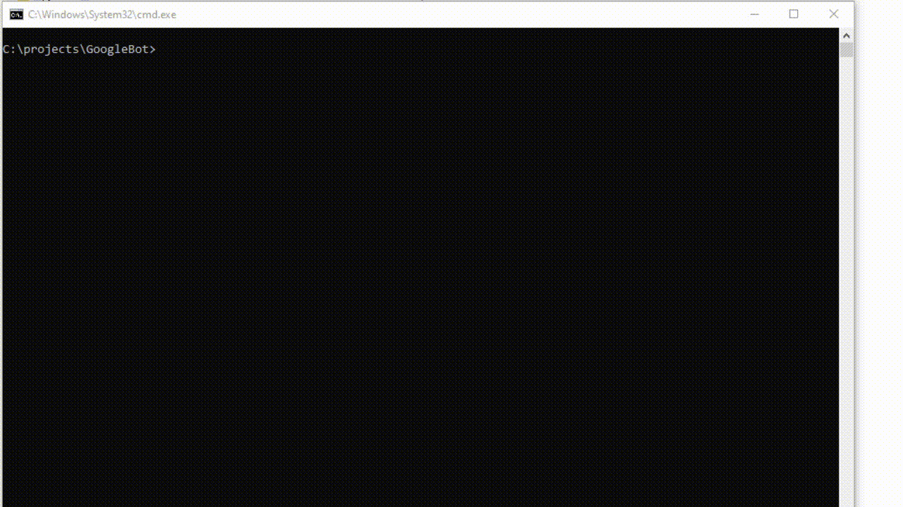
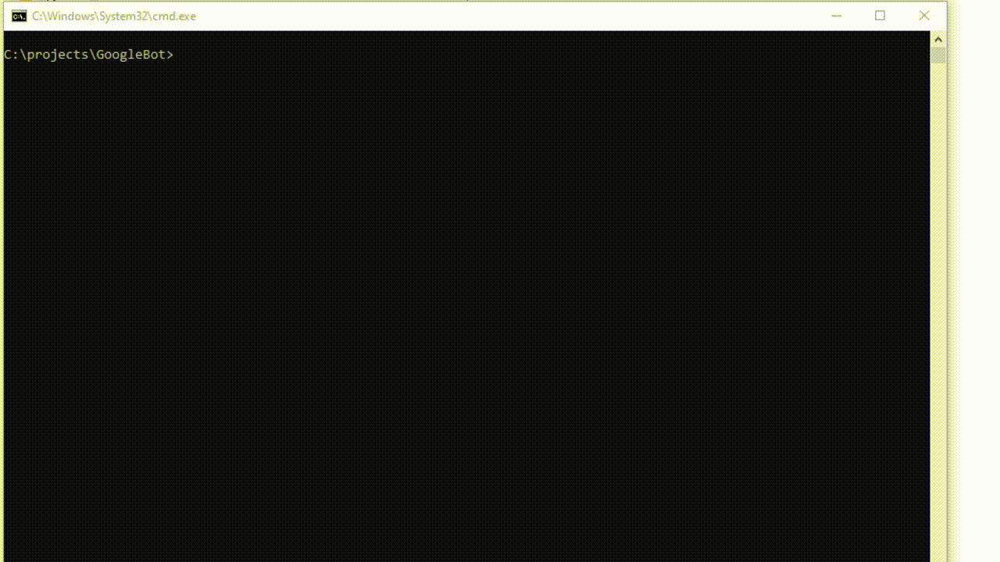

# Google Bot

Bem vindo ao simples Bot Google, criado por Thiago Souza.
(Welcome to the simple Google Bot, created by Thiago Souza.)





## Execute

No diretorio raiz, por favor execute o comando:
(In the root folder, please run)

```bash
python main.py
```
```

## License
[MIT](https://github.com/ThiagoSouzaBRA/GoogleBot/blob/main/LICENSE)